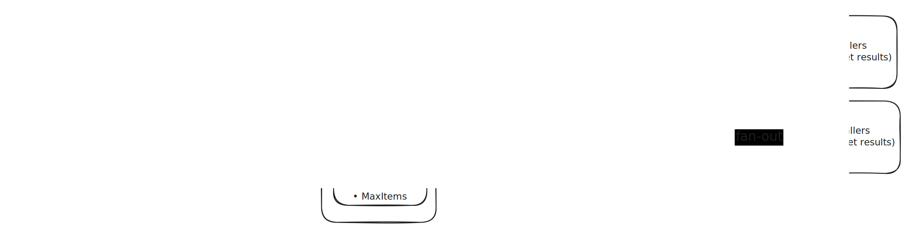

# Batcher Design Document

---

## Background

This design document is regarding the Github issue: https://github.com/kubernetes-sigs/karpenter-provider-ibm-cloud/issues/171. Briefly we want to add the Batching logic found in [AWS karpenter provider](https://github.com/aws/karpenter-provider-aws/blob/44c308875455fb50d011552cda0bc0b1c74d9aa5/pkg/batcher/batcher.go#L60) to IBM. The benefits we will get from the batcher as listed in the issue description:

- Reduced IBM Cloud API rate limiting
- Improved provisioning throughput
- Better resource utilization
- Enhanced observability through batch metrics

---

## Goals

This document discusses:

- An overview of the AWS Karpenter batcher design and its core concepts.
- Key differences between AWS and IBM Cloud APIs that impact batching.
- The proposed client-side batching approach tailored for IBM Cloud.
- Targeted use cases for batching (instance creation, pricing queries, load balancer updates).
- Observability and metrics used to evaluate batching effectiveness.

---

## AWS batching

### High Level Design



### Steps

1- Callers: The code that needs to make an api call (instance creation, pricing queries, etc…). Each caller gets their result back and doesn’t necessarily know there is batching happenning.

```go
result := batcher.Add(ctx, input)
```

2- Request Hasher: A function that determines which bucket a request belongs to.

```go
Input: CreateInstanceInput{Zone: "us-east-1", Type: "m5.large"}
Output: hash = 8472619374628
```

3- Buckets: A map grouping requests by their hash key. So, requests with same hash = same bucket = batched together

```go
requests map[uint64][]*request
```

4- Batch Window: A configurable time window to accumulate requests before processing. It waits for either:

| **Condition** | **Description** | **Example** |
| --- | --- | --- |
| IdleTimeout | No new requests for X duration | 35ms |
| MaxTimeout | Maximum wait time | 1 second |
| MaxItems | Maximum requests collected | 500 |

5- Batch Executor Pool: A pool of goroutines workers that execute batched API calls. Each bucket get its worker and each worker call the BatchExecutor which makes the actual API call. Typically there will be one result per input.

```go
type BatchExecutor[T, U] func(ctx context.Context, inputs []*T) []Result[U]
```

6- Fan-Out: Send results from batch execution back to individual callers.

```go
result1 → req1.requestor channel → Caller 1 unblocks
result2 → req2.requestor channel → Caller 2 unblocks
result3 → req3.requestor channel → Caller 3 unblocks
```

---

## IBM API Reality Check

Going through the [IBM documentation](https://cloud.ibm.com/apidocs/vpc/latest?code=go) this was found:

- The server-side “generic batcher pattern” (grouping multiple resource operations into a single API request to reduce HTTP calls) does not appear to be supported by the IBM Cloud VPC API for core resources (Instances, Load Balancers, etc.).
- For example: CreateInstance takes a single InstancePrototype and DeleteInstance deletes a single instance by ID. The closest thing in IBM is instance groups but those serve a different purpose.
- A more viable alternative would be a client-side batcher to eliminate redundant calls and for rate limiting.
- The exception found for it is the pricing queries.

---

## Where IBM differs from AWS

### Same

- The main batching logic could be reused from AWS.
- Metrics.

### Different

- IBM doesn’t have real batch endpoints`(Except for Pricing)`.
- Hash keys tailored to IBM (zone/resource group/etc…).
- Will have explicit retry logic based on rate limiting 429.

---

## IBM Specific Behavior

### Request bucketing (hash keys)

- Requests are bucketed in IBM so that only operations likely to compete for the same rate-limit will be put together. Rather than the input of specific API call like what AWS does.
- We will always prefer over-partitioning to under-partitioning. So, If it is unclear whether two requests compete for the same rate-limit, they are placed in separate buckets.
- Initial hash keys includes: Zone, Resource Groups, Resource identifiers for specific operations (e.g., load balancer ID).

### Rate limiting and retries

- The executor applies explicit retry logic based on IBM Cloud rate limiting responses HTTP 429 (Too Many Requests).
- The logic can be in ****the VPC Client Wrapper or in the BatchExecutor. For the second option the retry logic will be duplicated in every BatchExecutor. So we will go with the first option.
- We will depend on the **Retry-After** if present.

```go
func (c *VPCClient) CreateInstance(ctx context.Context, opts *vpcv1.CreateInstanceOptions) (*vpcv1.Instance, error) {
    return doWithRetry(ctx, func() (*vpcv1.Instance, *core.DetailedResponse, error) {
        return c.sdk.CreateInstance(opts)
    })
}

func doWithRetry[T any](ctx context.Context, fn func() (T, *core.DetailedResponse, error)) (T, error) {
    var zero T
    backoff := 100 * time.Millisecond

    for attempt := 0; attempt < 5; attempt++ {
        result, response, err := fn()

        if response == nil || response.StatusCode != 429 {
            return result, err
        }

        if ra := response.Headers.Get("Retry-After"); ra != "" {
            if secs, _ := strconv.Atoi(ra); secs > 0 {
                backoff = time.Duration(secs) * time.Second
            }
        }

        select {
        case <-ctx.Done():
            return zero, ctx.Err()
        case <-time.After(backoff):
            backoff = min(backoff*2, 30*time.Second)
        }
    }

    return zero, fmt.Errorf("rate limited after retries")
}
```

---

## IBM Detailed Implementation

We will are targeting: VPC instance creation, pricing queries, and load balancer updates.

Note: get and delete instance can be added too.

| **Batcher** | **Strategy** | **API Calls** |
| --- | --- | --- |
| CreateInstanceBatcher | Client-side batching (aggregation) | N calls per batch |
| PricingBatcher | True batching (deduplication) | 1 call per unique CatalogEntryID |
| LoadBalancerPoolBatcher | Client-side batching (aggregation) | N calls per batch |

### VPC Instance Creation

For instance creation we will bucket by `(zone, resourceGroupID)`

```go
type CreateInstanceBatcher struct {
	batcher *Batcher[*vpcv1.CreateInstanceOptions, *vpcv1.Instance]
}

func NewCreateInstanceBatcher(ctx context.Context, client *vpc.VPCClient) *CreateInstanceBatcher {
	options := Options[*vpcv1.CreateInstanceOptions, *vpcv1.Instance]{
		Name:        "create_instance",
		IdleTimeout: 50 * time.Millisecond,
		MaxTimeout:  1 * time.Second,
		MaxItems:    100,

		// Group by zone + resourceGroupID (derived from instance prototype/options)
		RequestHasher: CreateInstanceHasher{Client: client},

		BatchExecutor: execCreateInstanceBatch(client),
	}
	return &CreateInstanceBatcher{batcher: NewBatcher(ctx, options)}
}

func (b *CreateInstanceBatcher) CreateInstance(ctx context.Context, opts *vpcv1.CreateInstanceOptions) (*vpcv1.Instance, error) {
	res := b.batcher.Add(ctx, opts)
	return res.Output, res.Err
}

func execCreateInstanceBatch(client *vpc.VPCClient) BatchExecutor[*vpcv1.CreateInstanceOptions, *vpcv1.Instance] {
	return func(ctx context.Context, inputs []*vpcv1.CreateInstanceOptions) []Result[*vpcv1.Instance] {
		results := make([]Result[*vpcv1.Instance], len(inputs))

		for i, input := range inputs {
			out, err := client.CreateInstance(ctx, input)
			results[i] = Result[*vpcv1.Instance]{Output: out, Err: err}
		}

		return results
	}
}
```

### **Pricing Queries**

For pricing queries we will bucket by `(catalogEntryID)`

```go
type PricingQuery struct {
	CatalogEntryID string
}

type PricingBatcher struct {
	batcher *Batcher[*PricingQuery, *globalcatalogv1.PricingGet]
	client  *ibm.GlobalCatalogClient
}

func NewPricingBatcher(ctx context.Context, client *ibm.GlobalCatalogClient) *PricingBatcher {
	p := &PricingBatcher{client: client}

	opts := Options[*PricingQuery, *globalcatalogv1.PricingGet]{
		Name:        "global_catalog_pricing_get",
		IdleTimeout: 200 * time.Millisecond,
		MaxTimeout:  2 * time.Second,
		MaxItems:    200,

		// Group by catalogEntryID so identical pricing requests share one upstream call
		RequestHasher: PricingHasher{},

		BatchExecutor: p.execPricingBatch(),
	}

	p.batcher = NewBatcher(ctx, opts)
	return p
}

func (p *PricingBatcher) GetPricing(ctx context.Context, catalogEntryID string) (*globalcatalogv1.PricingGet, error) {
	res := p.batcher.Add(ctx, &PricingQuery{CatalogEntryID: catalogEntryID})
	return res.Output, res.Err
}

func (p *PricingBatcher) execPricingBatch() BatchExecutor[*PricingQuery, *globalcatalogv1.PricingGet] {
	return func(ctx context.Context, inputs []*PricingQuery) []Result[*globalcatalogv1.PricingGet] {
		results := make([]Result[*globalcatalogv1.PricingGet], len(inputs))
		if len(inputs) == 0 {
			return results
		}

		id := inputs[0].CatalogEntryID
		out, err := p.client.GetPricing(ctx, id)

		for i := range inputs {
			results[i] = Result[*globalcatalogv1.PricingGet]{Output: out, Err: err}
		}
		return results
	}
}
```

### Load Balancer Updates

For load balancer updates we will bucket by `(loadBalancerID, PoolID)`

```go
type UpdatePoolRequest struct {
	LoadBalancerID string
	PoolID         string
	Updates        map[string]interface{}
}

type LoadBalancerPoolBatcher struct {
	batcher *Batcher[*UpdatePoolRequest, *vpcv1.LoadBalancerPool]
}

func NewLoadBalancerPoolBatcher(ctx context.Context, client *vpc.VPCClient) *LoadBalancerPoolBatcher {
	options := Options[*UpdatePoolRequest, *vpcv1.LoadBalancerPool]{
		Name:        "lb_pool_update",
		IdleTimeout: 100 * time.Millisecond,
		MaxTimeout:  1 * time.Second,
		MaxItems:    50,

		// Group by LB + Pool (matches UpdateLoadBalancerPoolOptions{LoadBalancerID, ID})
		RequestHasher: LBPoolUpdateHasher{},

		BatchExecutor: execUpdatePoolBatch(client),
	}
	return &LoadBalancerPoolBatcher{batcher: NewBatcher(ctx, options)}
}

func (b *LoadBalancerPoolBatcher) UpdatePool(ctx context.Context, req *UpdatePoolRequest) (*vpcv1.LoadBalancerPool, error) {
	res := b.batcher.Add(ctx, req)
	return res.Output, res.Err
}

func execUpdatePoolBatch(client *vpc.VPCClient) BatchExecutor[*UpdatePoolRequest, *vpcv1.LoadBalancerPool] {
	return func(ctx context.Context, inputs []*UpdatePoolRequest) []Result[*vpcv1.LoadBalancerPool] {
		results := make([]Result[*vpcv1.LoadBalancerPool], len(inputs))

		for i, input := range inputs {
			out, err := client.UpdateLoadBalancerPool(ctx, input.LoadBalancerID, input.PoolID, input.Updates)
			results[i] = Result[*vpcv1.LoadBalancerPool]{Output: out, Err: err}
		}

		return results
	}
}
```

---

## Observability

First, we can reuse the metrics used in AWS. which are:

| **Metric** | **Description** | **Example** |
| --- | --- | --- |
| batch_time_seconds | How long batch window was open | 35ms |
| batch_size | Requests per batch | 10 |

```go
var (
	BatchWindowDuration = opmetrics.NewPrometheusHistogram(crmetrics.Registry, prometheus.HistogramOpts{
		Namespace: metrics.Namespace,
		Subsystem: batcherSubsystem,
		Name:      "batch_time_seconds",
		Help:      "Duration of the batching window per batcher",
		Buckets:   metrics.DurationBuckets(),
	}, []string{batcherNameLabel})
	BatchSize = opmetrics.NewPrometheusHistogram(crmetrics.Registry, prometheus.HistogramOpts{
		Namespace: metrics.Namespace,
		Subsystem: batcherSubsystem,
		Name:      "batch_size",
		Help:      "Size of the request batch per batcher",
		Buckets:   SizeBuckets(),
	}, []string{batcherNameLabel})
)
```

We can add specific metrics for IBM

| **Metric** | **Description** | **Example** |
| --- | --- | --- |
| rate_limit_retries_total | Are we hitting IBM rate limits | 10 |
| deduplicated_requests_total | Is deduplication working | 5 |

```go

var (
    // Track 429 retries
    RateLimitRetries = opmetrics.NewPrometheusCounter(crmetrics.Registry, prometheus.CounterOpts{
        Namespace: metrics.Namespace,
        Subsystem: batcherSubsystem,
        Name:      "rate_limit_retries_total",
        Help:      "Total number of 429 rate limit retries",
    }, []string{batcherNameLabel})

    // Track deduplication effectiveness (for pricing)
    DeduplicatedRequests = opmetrics.NewPrometheusCounter(crmetrics.Registry, prometheus.CounterOpts{
        Namespace: metrics.Namespace,
        Subsystem: batcherSubsystem,
        Name:      "deduplicated_requests_total",
        Help:      "Requests that were served from batch deduplication",
    }, []string{batcherNameLabel})
)
```
