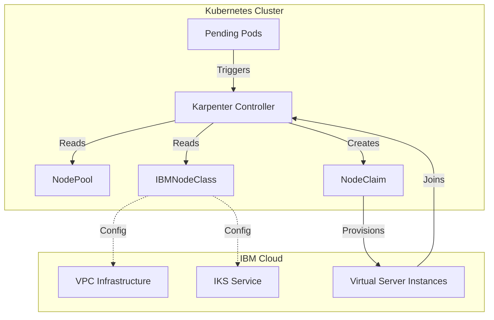

# Karpenter IBM Cloud Provider

  <h2>Automatic Node Provisioning for Kubernetes on IBM Cloud VPC</h2>
  

    
    
  

## Overview

The Karpenter IBM Cloud Provider enables automatic node provisioning and scaling for Kubernetes clusters running on IBM Cloud VPC infrastructure. It implements the Karpenter provisioning APIs to provide just-in-time compute resources based on application demands.

- :rocket: **[Getting Started](getting-started.md)**
  Get up and running with Karpenter on IBM Cloud in minutes

- :cloud: **[VPC Integration](vpc-integration.md)**
  Deploy on self-managed Kubernetes clusters with full control

- :office: **[IKS Integration](iks-integration.md)**
  Seamless integration with IBM Kubernetes Service

- :gear: **[Configuration](bootstrap-methods.md)**
  Learn about bootstrap methods and configuration options

- :building_construction: **[Nightly Builds](nightly-builds.md)**
  Access bleeding-edge features and development versions

- :speaking_head: **[Presentations](presentations.md)**
  Conference talks and demos about the project

- :question: **[FAQ](faq.md)**
  Frequently asked questions about Karpenter IBM Cloud Provider

## Key Features

### Automatic Node Provisioning
- **Just-in-Time Compute**: Provisions nodes automatically when pods are unschedulable
- **Intelligent Instance Selection**: Chooses optimal instance types based on workload requirements
- **Multi-Zone Support**: Distributes nodes across availability zones for high availability

### Zero-Configuration Bootstrap
- **Automatic Cluster Discovery**: Detects cluster configuration without manual setup
- **Dynamic Bootstrap Scripts**: Generates appropriate initialization scripts
- **Multiple Bootstrap Modes**: Supports VPC, IKS, and automatic mode selection

### Cost Optimization
- **Node Consolidation**: Automatically removes underutilized nodes
- **Right-Sizing**: Selects appropriate instance types to minimize costs

## Architecture

The Karpenter IBM Cloud Provider consists of several key components:

## Deployment Options

### VPC Self-Managed Clusters
- Full control over Kubernetes configuration
- Dynamic instance type selection
- Custom bootstrap configurations
- Ideal for specialized workloads

### IBM Kubernetes Service (IKS)
- Seamless integration with managed service
- Worker pool expansion

## Community

- **GitHub**: [Report issues and contribute](https://github.com/kubernetes-sigs/karpenter-provider-ibm-cloud)
- **Slack**: [Join #karpenter-ibm on CNCF Slack](https://cloud-native.slack.com/archives/C094SDPCVLN)

## License

This project is licensed under the Apache License 2.0. See the [LICENSE](https://github.com/kubernetes-sigs/karpenter-provider-ibm-cloud/blob/main/LICENSE) file for details.
